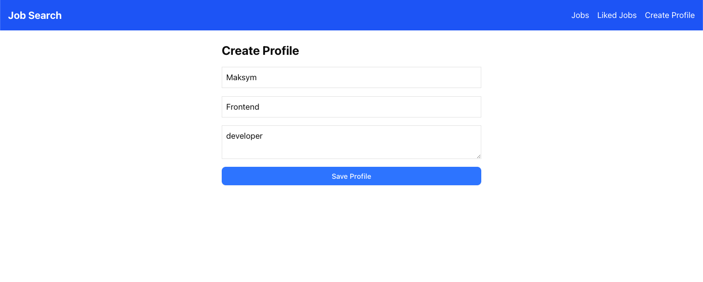
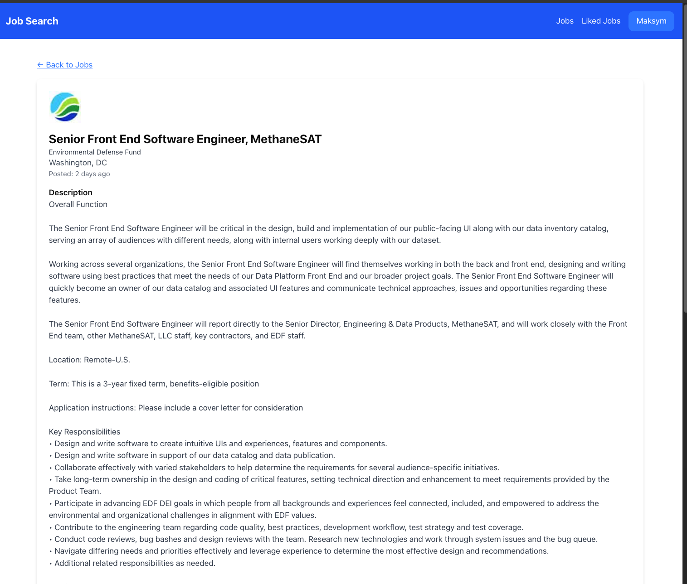
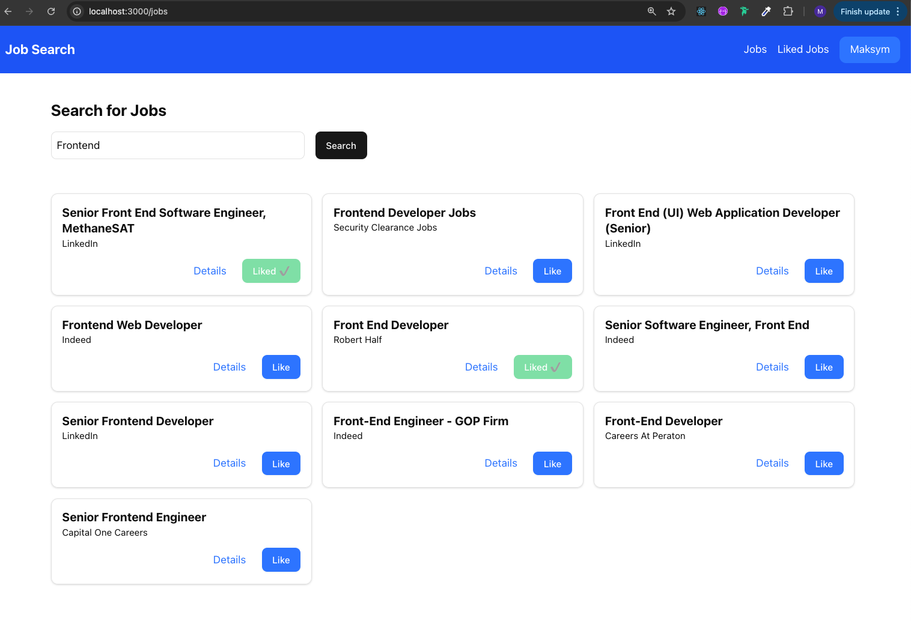
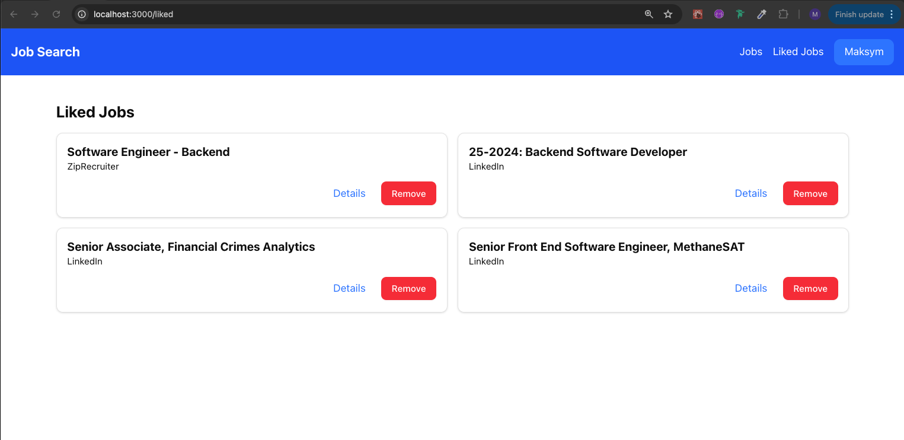

# Job search application

## Run Server app

```
cd server
cp .env.example .env
docker-compose up
```

### Examples

Request

```
curl -X POST http://localhost:3002/api/auth/register -H "Content-Type: application/json" -d '{ "email": "test1234@gmail.com", "password": "1234" }'
```

Response
`{"_id":"67c1eb14617f7c2e33ea2a51","email":"test1234@gmail.com"}`

Request

```
curl -X POST http://localhost:3002/api/auth/login -H "Content-Type: application/json" -d '{ "email": "test1234@gmail.com", "password": "1234" }'
```

Response

`{"_id":"67c1eb14617f7c2e33ea2a51","email":"test1234@gmail.com"}`

Request

```
curl -X POST http://localhost:3002/api/auth/logout -H "Content-Type: application/json"
```

Response
`{"message":"Logged out successfully"}`

## Run Client app

Make sure to add real RAPID_API_KEY in .env

```
cd client
cp .env.example .env.local
yarn install && yarn dev
```





